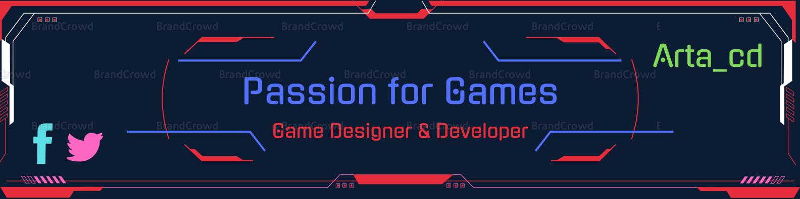

<h1 align="center">Hi 👋, I'm Arta</h1>
<h3 align="center">🚀 A passionate Frontend Developer</h3>

  

- 🔭 I’m currently working on [Fivem server](soon)

- 🌱 I’m currently learning **React.js, Lua, HTML, and CSS**

- 👯 I’m looking to collaborate on **Game development**

- 🤝 I’m looking for help with **Game development**

- 💬 Ask me about **React.js, Lua,Paython and ...**

- 📫 How to reach me **artanorani@gmail.com**

<h3 align="left">Connect with me:</h3>

<h3 align="left">Languages and Tools:</h3>

          

&nbsp;

